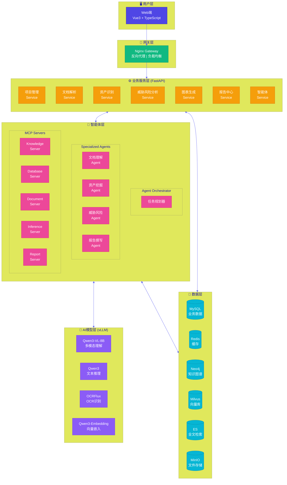

```mermaid
%%{init: {'theme': 'base', 'themeVariables': { 'primaryColor': '#4F46E5', 'primaryTextColor': '#fff', 'primaryBorderColor': '#3730A3', 'lineColor': '#6366F1'}}}%%

flowchart TB
    subgraph UserLayer["🖥️ 用户层"]
        Web["Web端<br/>Vue3 + TypeScript"]
    end

    subgraph Gateway["🚪 网关层"]
        Nginx["Nginx Gateway<br/>反向代理 | 负载均衡"]
    end

    subgraph Services["⚙️ 业务服务层 (FastAPI)"]
        direction TB
        ProjectSvc["项目管理<br/>Service"]
        DocSvc["文档解析<br/>Service"]
        AssetSvc["资产识别<br/>Service"]
        ThreatRiskSvc["威胁风险分析<br/>Service"]
        DiagramSvc["图表生成<br/>Service"]
        ReportSvc["报告中心<br/>Service"]
        AgentSvc["智能体<br/>Service"]
    end

    subgraph AgentLayer["🤖 智能体层"]
        direction TB
        subgraph Orchestrator["Agent Orchestrator"]
            Planner["任务规划器"]
        end
        subgraph Agents["Specialized Agents"]
            DocAgent["文档理解<br/>Agent"]
            AssetAgent["资产挖掘<br/>Agent"]
            ThreatRiskAgent["威胁风险<br/>Agent"]
            ReportAgent["报告撰写<br/>Agent"]
        end
        subgraph MCPServers["MCP Servers"]
            KnowledgeMCP["Knowledge<br/>Server"]
            DatabaseMCP["Database<br/>Server"]
            DocumentMCP["Document<br/>Server"]
            InferenceMCP["Inference<br/>Server"]
            ReportMCP["Report<br/>Server"]
        end
    end

    subgraph AILayer["🧠 AI模型层 (vLLM)"]
        direction LR
        Qwen3VL["Qwen3-VL-8B<br/>多模态理解"]
        Qwen3["Qwen3<br/>文本推理"]
        OCRFlux["OCRFlux<br/>OCR识别"]
        Embedding["Qwen3-Embedding<br/>向量嵌入"]
    end

    subgraph DataLayer["💾 数据层"]
        direction LR
        MySQL[("MySQL<br/>业务数据")]
        Redis[("Redis<br/>缓存")]
        Neo4j[("Neo4j<br/>知识图谱")]
        Milvus[("Milvus<br/>向量库")]
        ES[("ES<br/>全文检索")]
        MinIO[("MinIO<br/>文件存储")]
    end

    Web --> Nginx
    Nginx --> Services
    Services <--> AgentLayer
    AgentLayer <--> AILayer
    AgentLayer <--> DataLayer
    Services <--> DataLayer

    classDef userClass fill:#4F46E5,stroke:#3730A3,color:#fff
    classDef gatewayClass fill:#10B981,stroke:#059669,color:#fff
    classDef serviceClass fill:#F59E0B,stroke:#D97706,color:#fff
    classDef agentClass fill:#EC4899,stroke:#DB2777,color:#fff
    classDef aiClass fill:#8B5CF6,stroke:#7C3AED,color:#fff
    classDef dataClass fill:#06B6D4,stroke:#0891B2,color:#fff

    class Web userClass
    class Nginx gatewayClass
    class ProjectSvc,DocSvc,AssetSvc,ThreatRiskSvc,DiagramSvc,ReportSvc,AgentSvc serviceClass
    class Planner,DocAgent,AssetAgent,ThreatRiskAgent,ReportAgent,KnowledgeMCP,DatabaseMCP,DocumentMCP,InferenceMCP,ReportMCP agentClass
    class Qwen3VL,Qwen3,OCRFlux,Embedding aiClass
    class MySQL,Redis,Neo4j,Milvus,ES,MinIO dataClass
```
