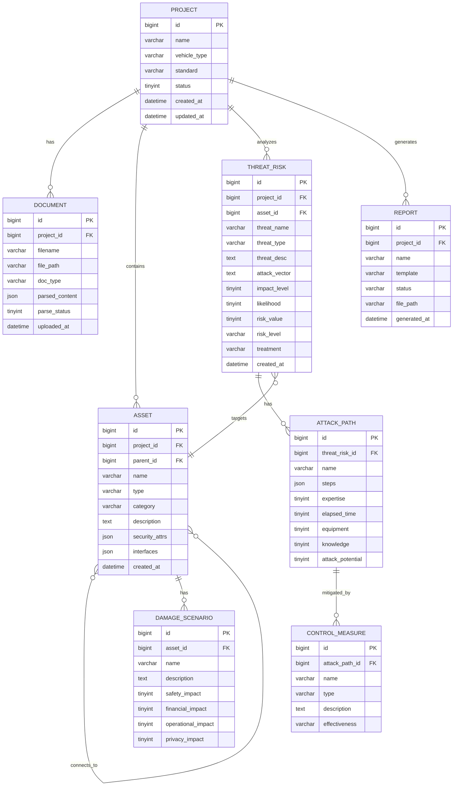

```mermaid
erDiagram
    PROJECT ||--o{ DOCUMENT : has
    PROJECT ||--o{ ASSET : contains
    PROJECT ||--o{ THREAT_RISK : analyzes
    PROJECT ||--o{ REPORT : generates
    
    ASSET ||--o{ ASSET : parent_of
    ASSET }o--o{ ASSET : connects_to
    ASSET ||--o{ DAMAGE_SCENARIO : has
    
    THREAT_RISK ||--o{ ATTACK_PATH : has
    THREAT_RISK }o--|| ASSET : targets
    
    ATTACK_PATH ||--o{ CONTROL_MEASURE : mitigated_by

    PROJECT {
        bigint id PK
        varchar name
        varchar vehicle_type
        varchar standard
        tinyint status
        datetime created_at
        datetime updated_at
    }
    
    DOCUMENT {
        bigint id PK
        bigint project_id FK
        varchar filename
        varchar file_path
        varchar doc_type
        json parsed_content
        tinyint parse_status
        datetime uploaded_at
    }
    
    ASSET {
        bigint id PK
        bigint project_id FK
        bigint parent_id FK
        varchar name
        varchar type
        varchar category
        text description
        json security_attrs
        json interfaces
        datetime created_at
    }
    
    DAMAGE_SCENARIO {
        bigint id PK
        bigint asset_id FK
        varchar name
        text description
        tinyint safety_impact
        tinyint financial_impact
        tinyint operational_impact
        tinyint privacy_impact
    }
    
    THREAT_RISK {
        bigint id PK
        bigint project_id FK
        bigint asset_id FK
        varchar threat_name
        varchar threat_type
        text threat_desc
        text attack_vector
        tinyint impact_level
        tinyint likelihood
        tinyint risk_value
        varchar risk_level
        varchar treatment
        datetime created_at
    }
    
    ATTACK_PATH {
        bigint id PK
        bigint threat_risk_id FK
        varchar name
        json steps
        tinyint expertise
        tinyint elapsed_time
        tinyint equipment
        tinyint knowledge
        tinyint attack_potential
    }
    
    CONTROL_MEASURE {
        bigint id PK
        bigint attack_path_id FK
        varchar name
        varchar type
        text description
        varchar effectiveness
    }
    
    REPORT {
        bigint id PK
        bigint project_id FK
        varchar name
        varchar template
        varchar status
        varchar file_path
        datetime generated_at
    }

```
