# 报告服务详细设计文档

## 1. 概述

报告服务（Report Service）是TARA Pro系统的核心服务之一，负责生成、管理和导出符合ISO/SAE 21434标准的TARA分析报告。该服务支持一键生成报告、多格式导出（PDF、Word、Excel）以及报告预览功能。

### 1.1 服务职责

- **报告生成**: 基于项目数据自动生成TARA分析报告
- **一键生成**: 从上传的文件（资产清单、架构图等）自动完成资产识别、威胁分析、风险评估和报告生成
- **多格式导出**: 支持PDF、Word（DOCX）、Excel（XLSX）格式导出
- **报告管理**: 创建、查询、删除报告记录
- **进度追踪**: 实时追踪报告生成进度

### 1.2 技术栈

| 组件 | 技术 |
|------|------|
| 框架 | FastAPI |
| ORM | SQLAlchemy |
| PDF生成 | ReportLab |
| Word生成 | python-docx |
| Excel生成 | openpyxl |
| 文件存储 | MinIO (可选) |
| 任务队列 | FastAPI BackgroundTasks |
| 服务间通信 | httpx (异步HTTP客户端) |

---

## 2. 模块架构图

### 2.1 报告服务架构总览

```
┌─────────────────────────────────────────────────────────────────────────────────────┐
│                                   Frontend (Vue.js)                                  │
│  ┌────────────────┐    ┌─────────────────┐    ┌────────────────┐                   │
│  │ReportGenerator │    │  ReportList     │    │ ReportDetail   │                   │
│  │  (一键生成)    │    │   (报告列表)    │    │  (报告预览)    │                   │
│  └───────┬────────┘    └────────┬────────┘    └───────┬────────┘                   │
└──────────┼──────────────────────┼─────────────────────┼────────────────────────────┘
           │                      │                     │
           ▼                      ▼                     ▼
┌─────────────────────────────────────────────────────────────────────────────────────┐
│                              API Gateway (Nginx)                                     │
│                       /api/v1/reports/* → report-service:8006                       │
└─────────────────────────────────────────────────────────────────────────────────────┘
           │
           ▼
┌─────────────────────────────────────────────────────────────────────────────────────┐
│                            Report Service (Port: 8006)                               │
│  ┌───────────────────────────────────────────────────────────────────────────────┐  │
│  │                              API Layer (FastAPI)                               │  │
│  │  ┌─────────────────────────────────────────────────────────────────────────┐  │  │
│  │  │ app/api/v1/endpoints/report.py                                          │  │  │
│  │  │ ├── POST /reports              - create_report()                        │  │  │
│  │  │ ├── GET  /reports              - list_reports()                         │  │  │
│  │  │ ├── GET  /reports/{id}         - get_report()                           │  │  │
│  │  │ ├── DELETE /reports/{id}       - delete_report()                        │  │  │
│  │  │ ├── POST /reports/oneclick     - oneclick_generate()                    │  │  │
│  │  │ ├── GET  /reports/oneclick/{task_id}/progress - get_generation_progress()│  │  │
│  │  │ ├── GET  /reports/{id}/download - download_report()                     │  │  │
│  │  │ └── GET  /reports/{id}/preview  - preview_report()                      │  │  │
│  │  └─────────────────────────────────────────────────────────────────────────┘  │  │
│  └───────────────────────────────────────────────────────────────────────────────┘  │
│  ┌───────────────────────────────────────────────────────────────────────────────┐  │
│  │                             Service Layer                                      │  │
│  │  ┌─────────────────────────────┐    ┌─────────────────────────────────────┐   │  │
│  │  │ ReportService               │    │ OneClickGenerateService              │   │  │
│  │  │ (app/services/report_       │    │ (app/services/oneclick_service.py)  │   │  │
│  │  │  service.py)                │    │                                     │   │  │
│  │  │ ├── create_report()         │    │ ├── start_generation()              │   │  │
│  │  │ ├── get_report()            │    │ ├── run_generation()                │   │  │
│  │  │ ├── list_reports()          │    │ ├── _upload_and_parse_documents()   │   │  │
│  │  │ ├── delete_report()         │    │ ├── _identify_assets_via_service()  │   │  │
│  │  │ ├── get_report_file()       │    │ ├── _analyze_threats_via_service()  │   │  │
│  │  │ └── get_report_preview()    │    │ ├── _assess_risks_via_service()     │   │  │
│  │  └─────────────────────────────┘    │ ├── _generate_report_from_services()│   │  │
│  │                                      │ └── _save_report_to_db_v2()         │   │  │
│  │                                      └─────────────────────────────────────┘   │  │
│  └───────────────────────────────────────────────────────────────────────────────┘  │
│  ┌───────────────────────────────────────────────────────────────────────────────┐  │
│  │                            Generator Layer                                     │  │
│  │  ┌────────────────┐    ┌────────────────┐    ┌─────────────────┐              │  │
│  │  │ PDFGenerator   │    │ WordGenerator  │    │ ExcelGenerator  │              │  │
│  │  │ (generators/   │    │ (generators/   │    │ (generators/    │              │  │
│  │  │  pdf_generator │    │  word_generator│    │  excel_generator│              │  │
│  │  │  .py)          │    │  .py)          │    │  .py)           │              │  │
│  │  │ └── generate() │    │ └── generate() │    │ └── generate()  │              │  │
│  │  └────────────────┘    └────────────────┘    └─────────────────┘              │  │
│  └───────────────────────────────────────────────────────────────────────────────┘  │
│  ┌───────────────────────────────────────────────────────────────────────────────┐  │
│  │                           Repository Layer                                     │  │
│  │  ┌─────────────────────────────────────────────────────────────────────────┐  │  │
│  │  │ ReportRepository (app/repositories/report_repo.py)                      │  │  │
│  │  │ ├── create()        ├── get_by_id()      ├── list_reports()            │  │  │
│  │  │ ├── update()        └── delete()         └── list_all_reports()        │  │  │
│  │  └─────────────────────────────────────────────────────────────────────────┘  │  │
│  └───────────────────────────────────────────────────────────────────────────────┘  │
└─────────────────────────────────────────────────────────────────────────────────────┘
```

### 2.2 服务间依赖关系图

```
                                 ┌───────────────────┐
                                 │   Report Service  │
                                 │     (8006)        │
                                 └─────────┬─────────┘
                                           │
           ┌───────────────┬───────────────┼───────────────┬───────────────┐
           │               │               │               │               │
           ▼               ▼               ▼               ▼               ▼
┌──────────────────┐┌──────────────────┐┌──────────────────┐┌──────────────────┐┌──────────────────┐
│Document Service  ││ Asset Service    ││Threat-Risk Service││Diagram Service   ││Project Service   │
│    (8002)        ││    (8003)        ││    (8004)        ││    (8005)        ││    (8001)        │
│                  ││                  ││                  ││                  ││                  │
│ • 文档上传       ││ • 资产识别       ││ • 威胁分析       ││ • 资产拓扑图     ││ • 项目信息       │
│ • 文档解析       ││ • 关系创建       ││ • 风险评估       ││ • 攻击树图       ││ • 项目统计       │
│ • 内容提取       ││ • 安全属性       ││ • 控制措施       ││ • 风险矩阵       ││                  │
└────────┬─────────┘└────────┬─────────┘└────────┬─────────┘└────────┬─────────┘└────────┬─────────┘
         │                   │                   │                   │                   │
         ▼                   ▼                   ▼                   ▼                   ▼
┌─────────────────────────────────────────────────────────────────────────────────────────────────┐
│                                      Shared Storage Layer                                        │
│  ┌─────────────┐   ┌─────────────┐   ┌─────────────┐   ┌─────────────┐   ┌─────────────┐       │
│  │   MySQL     │   │   Neo4j     │   │   MinIO     │   │   Redis     │   │  Milvus     │       │
│  │ (关系数据)  │   │(图数据库)   │   │(对象存储)   │   │  (缓存)     │   │(向量数据库) │       │
│  └─────────────┘   └─────────────┘   └─────────────┘   └─────────────┘   └─────────────┘       │
└─────────────────────────────────────────────────────────────────────────────────────────────────┘
```

---

## 3. 一键生成报告时序图

### 3.1 详细时序图 (Mermaid格式)

```mermaid
sequenceDiagram
    autonumber
    participant FE as Frontend<br/>(ReportGenerator.vue)
    participant NG as Nginx<br/>API Gateway
    participant RS as Report Service<br/>(8006)
    participant RSE as report.py<br/>(Endpoint)
    participant OCS as OneClickGenerateService
    participant DS as Document Service<br/>(8002)
    participant DSE as document.py<br/>(Endpoint)
    participant DSS as DocumentService
    participant AS as Asset Service<br/>(8003)
    participant ASE as asset.py<br/>(Endpoint)
    participant ASS as AssetService
    participant TS as Threat-Risk Service<br/>(8004)
    participant TSE as threat.py<br/>(Endpoint)
    participant TSS as ThreatService
    participant DGS as Diagram Service<br/>(8005)
    participant PS as Project Service<br/>(8001)
    participant DB as MySQL Database
    participant NEO as Neo4j Database
    participant MINIO as MinIO Storage

    Note over FE,MINIO: 阶段1: 初始化和文件上传
    FE->>NG: POST /api/v1/reports/oneclick<br/>[files, template, prompt, project_name]
    NG->>RSE: Forward Request
    RSE->>OCS: start_generation(task_id, files, template, prompt, project_name, task_storage)
    OCS->>MINIO: Save uploaded files to /tmp/tara_uploads/{task_id}/
    OCS->>DB: INSERT INTO projects (name, description, vehicle_type, standard, status)
    DB-->>OCS: project_id
    OCS->>DB: INSERT INTO reports (project_id, name, template, status=GENERATING)
    DB-->>OCS: report_id
    OCS-->>RSE: {project_id, report_id, file_paths}
    RSE->>RSE: Add BackgroundTask(run_generation)
    RSE-->>NG: {task_id, report_id, project_id, status: "processing"}
    NG-->>FE: HTTP 200 Response

    Note over FE,MINIO: 阶段2: 后台处理 - 文件解析 (10%)
    RSE->>OCS: run_generation(task_id, project_id, report_id, file_paths, template, prompt, task_storage)
    OCS->>OCS: _update_progress(task_storage, task_id, 0, 10, "解析文件")
    loop For each file_path
        OCS->>DS: POST /api/v1/documents/upload<br/>{file, project_id}
        DS->>DSE: upload_document(project_id, file, doc_type)
        DSE->>DSS: upload_document(project_id, filename, content, content_type)
        DSS->>DB: INSERT INTO documents
        DSS->>MINIO: Upload file to documents bucket
        DSS-->>DSE: Document entity
        DSE-->>DS: {document_id, filename, file_path, file_size}
        DS-->>OCS: document_id
        
        OCS->>DS: POST /api/v1/documents/{document_id}/parse-extract<br/>{extract_assets: true, extract_threats: true}
        DS->>DSE: parse_and_extract(document_id, extract_assets, extract_threats)
        DSE->>DSS: parse_and_extract(document_id, extract_assets, extract_threats)
        DSS->>DSS: _parse_document_content()
        DSS->>DSS: _extract_assets_from_content() [AI/Fallback]
        DSS->>DSS: _extract_threats_from_content() [AI/Fallback]
        DSS->>DB: UPDATE documents SET content, structure, extracted_assets
        DSS-->>DSE: {status, assets_count, threats_count, parsed_content}
        DSE-->>DS: Success response
        DS-->>OCS: Parsed result
    end

    Note over FE,MINIO: 阶段3: 资产识别 (30%)
    OCS->>OCS: _update_progress(task_storage, task_id, 1, 30, "识别资产")
    OCS->>OCS: _identify_assets_via_service(project_id, document_ids)
    loop For each document_id
        OCS->>AS: POST /api/v1/assets/identify-from-document<br/>{project_id, document_id, include_relations: true}
        AS->>ASE: identify_from_document(project_id, document_id, include_relations)
        ASE->>ASS: identify_from_document(project_id, document_id, include_relations)
        ASS->>DS: GET /api/v1/documents/{document_id}/extracted-assets
        DS->>DSE: get_extracted_assets(document_id)
        DSE->>DSS: get_extracted_assets(document_id)
        DSS->>DB: SELECT extracted_assets FROM documents
        DSS-->>DSE: assets list
        DSE-->>DS: {document_id, assets, total}
        DS-->>ASS: Extracted assets
        
        loop For each extracted asset
            ASS->>ASS: _create_asset_from_extracted(project_id, asset_data)
            ASS->>DB: INSERT INTO assets (project_id, name, asset_type, category, security_attrs, interfaces)
            DB-->>ASS: asset_id
        end
        
        alt include_relations == true
            ASS->>ASS: _create_asset_relations(assets)
            ASS->>NEO: CREATE (a:Asset)-[:CONNECTS_TO]->(b:Asset)
            NEO-->>ASS: Relation created
        end
        
        ASS-->>ASE: {created_assets, assets, relations}
        ASE-->>AS: Success response
        AS-->>OCS: Asset identification result
    end

    Note over FE,MINIO: 阶段4: 威胁分析 (50%)
    OCS->>OCS: _update_progress(task_storage, task_id, 2, 50, "威胁分析")
    OCS->>OCS: _analyze_threats_via_service(project_id)
    OCS->>TS: POST /api/v1/threats/analyze-project<br/>{project_id, asset_ids: null}
    TS->>TSE: analyze_threats_for_project(project_id, asset_ids)
    TSE->>TSS: analyze_threats_for_project(project_id, asset_ids)
    
    TSS->>AS: GET /api/v1/assets/project/{project_id}/all
    AS->>ASE: get_project_assets(project_id)
    ASE->>ASS: get_assets_for_project(project_id)
    ASS->>DB: SELECT * FROM assets WHERE project_id = ?
    DB-->>ASS: Assets list
    ASS-->>ASE: {project_id, assets, total}
    ASE-->>AS: Success response
    AS-->>TSS: Project assets
    
    loop For each asset
        TSS->>TSS: _analyze_asset_threats(asset)
        TSS->>TSS: _get_ai_threat_analysis(asset) [AI/STRIDE Fallback]
        loop For each threat
            TSS->>TSS: _create_threat_from_data(asset, threat_data)
            TSS->>DB: INSERT INTO threat_risks (project_id, asset_id, threat_name, threat_type, attack_vector, impact_level, risk_level)
        end
    end
    
    TSS-->>TSE: {created_threats, threats, risk_summary}
    TSE-->>TS: Success response
    TS-->>OCS: Threat analysis result

    Note over FE,MINIO: 阶段5: 风险评估 (75%)
    OCS->>OCS: _update_progress(task_storage, task_id, 3, 75, "风险评估")
    OCS->>OCS: _assess_risks_via_service(project_id)
    OCS->>TS: POST /api/v1/threats/assess-risks<br/>{project_id}
    TS->>TSE: assess_risks_for_project(project_id)
    TSE->>TSS: assess_risks_for_project(project_id)
    TSS->>DB: SELECT * FROM threat_risks WHERE project_id = ?
    DB-->>TSS: Threats list
    
    loop For each threat
        TSS->>TSS: Calculate risk level based on impact & likelihood
        TSS->>DB: UPDATE threat_risks SET risk_level = ?, cal_level = ?
        TSS->>TSS: Generate control measures
        TSS->>DB: INSERT INTO control_measures (threat_id, name, control_type, implementation)
    end
    
    TSS-->>TSE: {total_threats, risk_distribution, high_risk_count}
    TSE-->>TS: Success response
    TS-->>OCS: Risk assessment result

    Note over FE,MINIO: 阶段6: 报告生成 (90%-100%)
    OCS->>OCS: _update_progress(task_storage, task_id, 4, 90, "生成报告")
    OCS->>OCS: _generate_report_from_services(project_id, report_id, template)
    
    par Parallel data fetching
        OCS->>PS: GET /api/v1/projects/{project_id}
        PS-->>OCS: Project info
    and
        OCS->>AS: GET /api/v1/assets/project/{project_id}/all
        AS-->>OCS: Assets list
    and
        OCS->>TS: GET /api/v1/threats/project/{project_id}/all
        TS-->>OCS: Threats list
    and
        OCS->>TS: GET /api/v1/threats/project/{project_id}/measures
        TS-->>OCS: Control measures list
    and
        OCS->>DGS: GET /api/v1/diagrams/item-boundary/{project_id}
        DGS-->>OCS: Item boundary diagram (PNG)
    and
        OCS->>DGS: GET /api/v1/diagrams/system-architecture/{project_id}
        DGS-->>OCS: System architecture diagram (PNG)
    and
        OCS->>DGS: GET /api/v1/diagrams/software-architecture/{project_id}
        DGS-->>OCS: Software architecture diagram (PNG)
    end
    
    OCS->>OCS: Aggregate report_data {project, assets, threats, measures, diagrams, risk_distribution}
    OCS->>OCS: _save_report_to_db_v2(report_id, report_data)
    OCS->>DB: UPDATE reports SET status=COMPLETED, content=?, statistics=?, sections=?
    DB-->>OCS: Success
    
    OCS->>PS: PATCH /api/v1/projects/{project_id}/status?status=2
    PS-->>OCS: Project status updated to completed
    
    OCS->>OCS: Update task_storage[task_id] = {status: "completed", progress: 100}

    Note over FE,MINIO: 阶段7: 前端轮询进度
    loop Polling until completed
        FE->>NG: GET /api/v1/reports/oneclick/{task_id}/progress
        NG->>RSE: get_generation_progress(task_id)
        RSE->>RSE: Read from _generation_tasks[task_id]
        RSE-->>NG: {status, progress, current_step, steps, result}
        NG-->>FE: Progress response
    end

    Note over FE,MINIO: 阶段8: 报告下载
    FE->>NG: GET /api/v1/reports/{report_id}/download?format=pdf
    NG->>RSE: download_report(report_id, format)
    RSE->>RS: ReportService.get_report_file(report_id, "pdf")
    RS->>DB: SELECT * FROM reports WHERE id = ?
    DB-->>RS: Report entity with content
    RS->>RS: PDFGenerator.generate(data, template)
    RS-->>RSE: (BytesIO buffer, filename)
    RSE-->>NG: StreamingResponse with PDF
    NG-->>FE: PDF file download
```



### 3.2 简化时序图 (ASCII)

```
┌────────┐  ┌────────┐  ┌──────────────┐  ┌────────────────┐  ┌─────────────┐  ┌────────────────┐  ┌─────────────┐  ┌────────┐
│Frontend│  │ Nginx  │  │Report Service│  │Document Service│  │Asset Service│  │Threat-Risk Svc │  │Diagram Svc  │  │Database│
└───┬────┘  └───┬────┘  └──────┬───────┘  └───────┬────────┘  └──────┬──────┘  └───────┬────────┘  └──────┬──────┘  └───┬────┘
    │           │              │                   │                  │                 │                  │              │
    │ POST /reports/oneclick   │                   │                  │                 │                  │              │
    │──────────────────────────>                   │                  │                 │                  │              │
    │           │              │                   │                  │                 │                  │              │
    │           │              │ Create Project    │                  │                 │                  │              │
    │           │              │───────────────────────────────────────────────────────────────────────────────────────────>
    │           │              │                   │                  │                 │                  │              │
    │           │              │ Create Report     │                  │                 │                  │              │
    │           │              │───────────────────────────────────────────────────────────────────────────────────────────>
    │           │              │                   │                  │                 │                  │              │
    │ {task_id, report_id}     │                   │                  │                 │                  │              │
    │<──────────────────────────                   │                  │                 │                  │              │
    │           │              │                   │                  │                 │                  │              │
    │           │              │ ═══════════════════════════════════════════════════════════════════════════════════════════
    │           │              │ ║                    Background Task: run_generation()                                    ║
    │           │              │ ═══════════════════════════════════════════════════════════════════════════════════════════
    │           │              │                   │                  │                 │                  │              │
    │           │              │ [Step 1: 10%]     │                  │                 │                  │              │
    │           │              │ POST /documents/upload               │                 │                  │              │
    │           │              │──────────────────>│                  │                 │                  │              │
    │           │              │                   │ Save to DB       │                 │                  │              │
    │           │              │                   │─────────────────────────────────────────────────────────────────────────>
    │           │              │                   │                  │                 │                  │              │
    │           │              │ POST /documents/{id}/parse-extract   │                 │                  │              │
    │           │              │──────────────────>│                  │                 │                  │              │
    │           │              │                   │ Parse & Extract  │                 │                  │              │
    │           │              │                   │─────────────────────────────────────────────────────────────────────────>
    │           │              │                   │                  │                 │                  │              │
    │           │              │ [Step 2: 30%]     │                  │                 │                  │              │
    │           │              │ POST /assets/identify-from-document  │                 │                  │              │
    │           │              │────────────────────────────────────>│                 │                  │              │
    │           │              │                   │                  │ GET /documents/{id}/extracted-assets               │
    │           │              │                   │<─────────────────│                 │                  │              │
    │           │              │                   │                  │ Create Assets   │                  │              │
    │           │              │                   │                  │─────────────────────────────────────────────────────>
    │           │              │                   │                  │ Create Neo4j Relations             │              │
    │           │              │                   │                  │─────────────────────────────────────────────────────>
    │           │              │                   │                  │                 │                  │              │
    │ GET /oneclick/{task_id}/progress             │                  │                 │                  │              │
    │──────────────────────────>                   │                  │                 │                  │              │
    │ {progress: 30%}          │                   │                  │                 │                  │              │
    │<──────────────────────────                   │                  │                 │                  │              │
    │           │              │                   │                  │                 │                  │              │
    │           │              │ [Step 3: 50%]     │                  │                 │                  │              │
    │           │              │ POST /threats/analyze-project        │                 │                  │              │
    │           │              │────────────────────────────────────────────────────────>                  │              │
    │           │              │                   │                  │ GET /assets/project/{id}/all       │              │
    │           │              │                   │                  │<────────────────│                  │              │
    │           │              │                   │                  │                 │ STRIDE Analysis  │              │
    │           │              │                   │                  │                 │─────────────────────────────────────>
    │           │              │                   │                  │                 │                  │              │
    │           │              │ [Step 4: 75%]     │                  │                 │                  │              │
    │           │              │ POST /threats/assess-risks           │                 │                  │              │
    │           │              │────────────────────────────────────────────────────────>                  │              │
    │           │              │                   │                  │                 │ Risk Assessment  │              │
    │           │              │                   │                  │                 │─────────────────────────────────────>
    │           │              │                   │                  │                 │                  │              │
    │           │              │ [Step 5: 90%] 并行获取数据           │                 │                  │              │
    │           │              │─────────────────────────────────────────────────────────────────────────────────────────────>
    │           │              │                   │                  │                 │                  │              │
    │           │              │ GET /diagrams/item-boundary/{project_id}               │                  │              │
    │           │              │───────────────────────────────────────────────────────────────────────────>              │
    │           │              │                   │                  │                 │                  │              │
    │           │              │ [Step 6: 100%] Save report to DB     │                 │                  │              │
    │           │              │───────────────────────────────────────────────────────────────────────────────────────────>
    │           │              │                   │                  │                 │                  │              │
    │ GET /oneclick/{task_id}/progress             │                  │                 │                  │              │
    │──────────────────────────>                   │                  │                 │                  │              │
    │ {status: "completed"}    │                   │                  │                 │                  │              │
    │<──────────────────────────                   │                  │                 │                  │              │
    │           │              │                   │                  │                 │                  │              │
    │ GET /reports/{id}/download?format=pdf        │                  │                 │                  │              │
    │──────────────────────────>                   │                  │                 │                  │              │
    │           │              │ Generate PDF      │                  │                 │                  │              │
    │           │              │───────────────────────────────────────────────────────────────────────────────────────────>
    │ PDF File                 │                   │                  │                 │                  │              │
    │<──────────────────────────                   │                  │                 │                  │              │
```

---

## 4. 依赖服务API接口规范

### 4.1 Document Service (文档服务) - Port 8002

#### 4.1.1 上传文档

```http
POST /api/v1/documents/upload
Content-Type: multipart/form-data
```

**请求参数:**

| 参数 | 类型 | 必填 | 描述 |
|------|------|------|------|
| project_id | int (Form) | 是 | 项目ID |
| file | File | 是 | 上传的文件 |
| doc_type | string (Form) | 否 | 文档类型 |

**响应示例:**

```json
{
  "success": true,
  "code": 200,
  "message": "文档上传成功",
  "data": {
    "document_id": 1,
    "filename": "asset_list.xlsx",
    "file_path": "documents/1/asset_list.xlsx",
    "file_size": 10240
  }
}
```

#### 4.1.2 解析并提取文档内容

```http
POST /api/v1/documents/{document_id}/parse-extract
```

**请求参数:**

| 参数 | 类型 | 必填 | 描述 |
|------|------|------|------|
| document_id | int (Path) | 是 | 文档ID |
| extract_assets | bool (Query) | 否 | 是否提取资产 (默认true) |
| extract_threats | bool (Query) | 否 | 是否提取威胁 (默认false) |

**响应示例:**

```json
{
  "success": true,
  "code": 200,
  "message": "文档解析和提取完成",
  "data": {
    "status": "completed",
    "document_id": 1,
    "assets_count": 8,
    "threats_count": 5,
    "parsed_content": {
      "title": "IVI系统资产清单",
      "sections": ["硬件组件", "软件组件", "外部接口"],
      "tables": [...]
    },
    "extracted_assets": [
      {
        "name": "IVI ECU",
        "type": "ECU",
        "category": "内部实体",
        "interfaces": ["CAN", "Ethernet"],
        "security_attrs": {"confidentiality": true, "integrity": true, "availability": true}
      }
    ]
  }
}
```

#### 4.1.3 获取提取的资产

```http
GET /api/v1/documents/{document_id}/extracted-assets
```

**请求参数:**

| 参数 | 类型 | 必填 | 描述 |
|------|------|------|------|
| document_id | int (Path) | 是 | 文档ID |

**响应示例:**

```json
{
  "success": true,
  "code": 200,
  "data": {
    "document_id": 1,
    "assets": [
      {
        "name": "IVI ECU",
        "type": "ECU",
        "category": "内部实体",
        "description": "车载信息娱乐系统核心控制单元",
        "interfaces": [
          {"type": "CAN", "connected_to": "Gateway"},
          {"type": "Ethernet", "connected_to": "TBOX"}
        ],
        "security_attrs": {
          "authenticity": true,
          "integrity": true,
          "confidentiality": true,
          "availability": true,
          "authorization": false,
          "non_repudiation": false
        },
        "criticality": "high"
      }
    ],
    "total": 8
  }
}
```

---

### 4.2 Asset Service (资产服务) - Port 8003

#### 4.2.1 从文档识别资产

```http
POST /api/v1/assets/identify-from-document
```

**请求参数:**

| 参数 | 类型 | 必填 | 描述 |
|------|------|------|------|
| project_id | int (Query) | 是 | 项目ID |
| document_id | int (Query) | 是 | 文档ID |
| include_relations | bool (Query) | 否 | 是否创建资产关系 (默认true) |

**响应示例:**

```json
{
  "success": true,
  "code": 200,
  "message": "成功识别并创建 8 个资产",
  "data": {
    "created_assets": 8,
    "assets": [
      {
        "id": 1,
        "name": "IVI ECU",
        "asset_type": "ECU",
        "category": "内部实体",
        "project_id": 1
      },
      {
        "id": 2,
        "name": "Gateway",
        "asset_type": "ECU",
        "category": "内部实体",
        "project_id": 1
      }
    ],
    "relations": [
      {
        "source_id": 1,
        "target_id": 2,
        "relation_type": "CONNECTS_TO",
        "interface": "CAN"
      }
    ]
  }
}
```

#### 4.2.2 获取项目所有资产

```http
GET /api/v1/assets/project/{project_id}/all
```

**请求参数:**

| 参数 | 类型 | 必填 | 描述 |
|------|------|------|------|
| project_id | int (Path) | 是 | 项目ID |

**响应示例:**

```json
{
  "success": true,
  "code": 200,
  "data": {
    "project_id": 1,
    "assets": [
      {
        "id": 1,
        "name": "IVI ECU",
        "asset_type": "ECU",
        "category": "内部实体",
        "description": "车载信息娱乐系统",
        "interfaces": [
          {"type": "CAN", "connected_to": "Gateway"},
          {"type": "Ethernet", "connected_to": "TBOX"}
        ],
        "security_attrs": {
          "authenticity": true,
          "integrity": true,
          "confidentiality": true,
          "availability": true
        },
        "criticality": "high",
        "created_at": "2024-12-16T10:00:00Z"
      }
    ],
    "total": 8
  }
}
```

---

### 4.3 Threat-Risk Service (威胁风险服务) - Port 8004

#### 4.3.1 项目威胁分析

```http
POST /api/v1/threats/analyze-project
```

**请求参数:**

| 参数 | 类型 | 必填 | 描述 |
|------|------|------|------|
| project_id | int (Query) | 是 | 项目ID |
| asset_ids | List[int] (Query) | 否 | 资产ID列表 (为空则分析所有资产) |

**响应示例:**

```json
{
  "success": true,
  "code": 200,
  "message": "威胁分析完成，共创建 15 个威胁",
  "data": {
    "created_threats": 15,
    "threats": [
      {
        "id": 1,
        "threat_name": "CAN消息欺骗",
        "threat_type": "S",
        "category_name": "Spoofing",
        "attack_vector": "CAN Bus",
        "description": "攻击者可能通过伪造CAN消息控制车辆功能",
        "asset_id": 1,
        "asset_name": "IVI ECU"
      }
    ],
    "risk_summary": {
      "critical": 2,
      "high": 5,
      "medium": 6,
      "low": 2
    }
  }
}
```

#### 4.3.2 风险评估

```http
POST /api/v1/threats/assess-risks
```

**请求参数:**

| 参数 | 类型 | 必填 | 描述 |
|------|------|------|------|
| project_id | int (Query) | 是 | 项目ID |

**响应示例:**

```json
{
  "success": true,
  "code": 200,
  "message": "风险评估完成，共分析 15 个威胁",
  "data": {
    "total_threats": 15,
    "risk_distribution": {
      "CAL-4": 2,
      "CAL-3": 5,
      "CAL-2": 6,
      "CAL-1": 2
    },
    "high_risk_count": 7,
    "assessed_threats": [
      {
        "id": 1,
        "threat_name": "CAN消息欺骗",
        "risk_level": "CAL-3",
        "impact_level": "Severe",
        "likelihood": "Medium",
        "safety_impact": 3,
        "financial_impact": 2,
        "operational_impact": 3,
        "privacy_impact": 1
      }
    ]
  }
}
```

#### 4.3.3 获取项目所有威胁

```http
GET /api/v1/threats/project/{project_id}/all
```

**请求参数:**

| 参数 | 类型 | 必填 | 描述 |
|------|------|------|------|
| project_id | int (Path) | 是 | 项目ID |

**响应示例:**

```json
{
  "success": true,
  "code": 200,
  "data": {
    "project_id": 1,
    "threats": [
      {
        "id": 1,
        "threat_name": "CAN消息欺骗",
        "threat_type": "S",
        "threat_desc": "攻击者可能通过伪造CAN消息控制车辆功能",
        "attack_vector": "CAN Bus",
        "attack_path": "外部接口 -> CAN网关 -> 目标ECU",
        "asset_id": 1,
        "asset_name": "IVI ECU",
        "likelihood": "Medium",
        "impact_level": "Severe",
        "risk_level": "CAL-3",
        "safety_impact": 3,
        "financial_impact": 2,
        "operational_impact": 3,
        "privacy_impact": 1,
        "status": "identified",
        "created_at": "2024-12-16T10:00:00Z"
      }
    ],
    "total": 15
  }
}
```

#### 4.3.4 获取项目控制措施

```http
GET /api/v1/threats/project/{project_id}/measures
```

**请求参数:**

| 参数 | 类型 | 必填 | 描述 |
|------|------|------|------|
| project_id | int (Path) | 是 | 项目ID |

**响应示例:**

```json
{
  "success": true,
  "code": 200,
  "data": {
    "project_id": 1,
    "measures": [
      {
        "id": 1,
        "name": "CAN消息认证",
        "control_type": "prevention",
        "category": "加密认证",
        "description": "对CAN消息进行MAC认证",
        "implementation": "使用SecOC对CAN消息进行消息认证码计算和验证",
        "effectiveness": "high",
        "priority": "high",
        "status": "planned",
        "threat_id": 1,
        "threat_name": "CAN消息欺骗",
        "iso21434_ref": "RQ-09-01",
        "created_at": "2024-12-16T10:00:00Z"
      }
    ],
    "total": 12
  }
}
```

---

### 4.4 Project Service (项目服务) - Port 8001

#### 4.4.1 获取项目详情

```http
GET /api/v1/projects/{project_id}
```

**请求参数:**

| 参数 | 类型 | 必填 | 描述 |
|------|------|------|------|
| project_id | int (Path) | 是 | 项目ID |
| include_stats | bool (Query) | 否 | 是否包含统计数据 (默认false) |

**响应示例:**

```json
{
  "success": true,
  "code": 200,
  "data": {
    "id": 1,
    "name": "IVI系统TARA分析",
    "description": "车载信息娱乐系统威胁分析和风险评估",
    "vehicle_type": "乘用车",
    "vehicle_model": "Model X",
    "standard": "ISO/SAE 21434",
    "scope": "IVI ECU及其外部接口",
    "status": 2,
    "created_at": "2024-12-16T10:00:00Z",
    "updated_at": "2024-12-16T10:30:00Z",
    "stats": {
      "assets_count": 8,
      "threats_count": 15,
      "reports_count": 1
    }
  }
}
```

#### 4.4.2 更新项目状态

```http
PATCH /api/v1/projects/{project_id}/status
```

**请求参数:**

| 参数 | 类型 | 必填 | 描述 |
|------|------|------|------|
| project_id | int (Path) | 是 | 项目ID |
| status | int (Query) | 是 | 项目状态 (0=待处理, 1=进行中, 2=已完成, 3=已归档) |

**响应示例:**

```json
{
  "success": true,
  "code": 200,
  "message": "项目状态更新成功",
  "data": {
    "id": 1,
    "name": "IVI系统TARA分析",
    "status": 2,
    "updated_at": "2024-12-16T10:30:00Z"
  }
}
```

---

### 4.5 Diagram Service (图表服务) - Port 8005

#### 4.5.1 获取项目边界图

```http
GET /api/v1/diagrams/item-boundary/{project_id}
```

**请求参数:**

| 参数 | 类型 | 必填 | 描述 |
|------|------|------|------|
| project_id | int (Path) | 是 | 项目ID |
| format | string (Query) | 否 | 输出格式: png, svg, pdf (默认png) |

**响应:**

- Content-Type: image/png (或对应格式)
- Body: 二进制图片数据

#### 4.5.2 获取系统架构图

```http
GET /api/v1/diagrams/system-architecture/{project_id}
```

**请求参数:**

| 参数 | 类型 | 必填 | 描述 |
|------|------|------|------|
| project_id | int (Path) | 是 | 项目ID |
| format | string (Query) | 否 | 输出格式: png, svg, pdf (默认png) |

**响应:**

- Content-Type: image/png
- Body: 二进制图片数据

#### 4.5.3 获取软件架构图

```http
GET /api/v1/diagrams/software-architecture/{project_id}
```

**请求参数:**

| 参数 | 类型 | 必填 | 描述 |
|------|------|------|------|
| project_id | int (Path) | 是 | 项目ID |
| format | string (Query) | 否 | 输出格式: png, svg, pdf (默认png) |

**响应:**

- Content-Type: image/png
- Body: 二进制图片数据

#### 4.5.4 获取资产拓扑图

```http
GET /api/v1/diagrams/asset-graph/{project_id}
```

**请求参数:**

| 参数 | 类型 | 必填 | 描述 |
|------|------|------|------|
| project_id | int (Path) | 是 | 项目ID |
| format | string (Query) | 否 | 输出格式: png, svg, pdf (默认png) |

**响应:**

- Content-Type: image/png
- Body: 二进制图片数据

#### 4.5.5 获取攻击树图

```http
GET /api/v1/diagrams/attack-tree/{threat_id}
```

**请求参数:**

| 参数 | 类型 | 必填 | 描述 |
|------|------|------|------|
| threat_id | int (Path) | 是 | 威胁ID |
| format | string (Query) | 否 | 输出格式: png, svg, pdf (默认png) |

**响应:**

- Content-Type: image/png
- Body: 二进制图片数据

#### 4.5.6 获取风险矩阵图

```http
GET /api/v1/diagrams/risk-matrix/{project_id}
```

**请求参数:**

| 参数 | 类型 | 必填 | 描述 |
|------|------|------|------|
| project_id | int (Path) | 是 | 项目ID |
| format | string (Query) | 否 | 输出格式: png, svg, pdf (默认png) |

**响应:**

- Content-Type: image/png
- Body: 二进制图片数据

---

## 5. 报告服务对外API接口规范

### 5.1 基础信息

| 属性 | 值 |
|------|-----|
| Base URL | `/api/v1/reports` |
| 认证方式 | Bearer Token |
| 响应格式 | JSON |
| 服务端口 | 8006 |

### 5.2 接口列表

#### 5.2.1 创建报告

```http
POST /api/v1/reports
Content-Type: application/json
```

**请求参数 (ReportCreate):**

| 字段 | 类型 | 必填 | 描述 |
|------|------|------|------|
| project_id | int | 是 | 项目ID |
| name | string | 是 | 报告名称 (max: 200) |
| report_type | string | 否 | 报告类型 (默认: "tara") |
| description | string | 否 | 描述 |
| template | string | 否 | 模板名称 |
| sections | List[string] | 否 | 包含的章节 |
| file_format | string | 否 | 输出格式 (默认: "pdf") |
| author | string | 否 | 作者 |

**请求示例:**

```json
{
  "project_id": 1,
  "name": "TARA分析报告",
  "report_type": "tara",
  "description": "IVI系统威胁分析和风险评估报告",
  "template": "iso21434",
  "sections": ["scope", "assets", "threats", "risks", "controls"],
  "file_format": "pdf",
  "author": "张工程师"
}
```

**响应示例:**

```json
{
  "success": true,
  "code": 200,
  "message": "Success",
  "data": {
    "id": 1,
    "project_id": 1,
    "name": "TARA分析报告",
    "report_type": "tara",
    "description": "IVI系统威胁分析和风险评估报告",
    "template": "iso21434",
    "status": 0,
    "progress": 0,
    "version": "1.0",
    "author": "张工程师",
    "created_at": "2024-12-16T10:00:00Z",
    "updated_at": "2024-12-16T10:00:00Z"
  }
}
```

#### 5.2.2 获取报告列表

```http
GET /api/v1/reports
```

**请求参数:**

| 参数 | 类型 | 必填 | 描述 |
|------|------|------|------|
| project_id | int (Query) | 否 | 项目ID，为空返回所有报告 |
| page | int (Query) | 否 | 页码 (默认: 1) |
| page_size | int (Query) | 否 | 每页数量 (默认: 20, max: 100) |
| status | int (Query) | 否 | 报告状态 (0-3) |

**响应示例:**

```json
{
  "success": true,
  "code": 200,
  "data": {
    "items": [
      {
        "id": 1,
        "project_id": 1,
        "name": "TARA分析报告",
        "report_type": "tara",
        "status": 2,
        "progress": 100,
        "template": "iso21434",
        "version": "1.0",
        "statistics": {
          "assets_count": 8,
          "threats_count": 15,
          "measures_count": 12,
          "high_risk_count": 7
        },
        "created_at": "2024-12-16T10:00:00Z",
        "updated_at": "2024-12-16T10:30:00Z"
      }
    ],
    "total": 1,
    "page": 1,
    "page_size": 20
  }
}
```

#### 5.2.3 获取报告详情

```http
GET /api/v1/reports/{report_id}
```

**请求参数:**

| 参数 | 类型 | 必填 | 描述 |
|------|------|------|------|
| report_id | int (Path) | 是 | 报告ID |

**响应示例:**

```json
{
  "success": true,
  "code": 200,
  "data": {
    "id": 1,
    "project_id": 1,
    "name": "TARA分析报告",
    "report_type": "tara",
    "description": "IVI系统威胁分析和风险评估报告",
    "template": "iso21434",
    "status": 2,
    "progress": 100,
    "version": "1.0",
    "author": "张工程师",
    "statistics": {
      "assets_count": 8,
      "threats_count": 15,
      "measures_count": 12,
      "high_risk_count": 7
    },
    "created_at": "2024-12-16T10:00:00Z",
    "updated_at": "2024-12-16T10:30:00Z"
  }
}
```

#### 5.2.4 删除报告

```http
DELETE /api/v1/reports/{report_id}
```

**请求参数:**

| 参数 | 类型 | 必填 | 描述 |
|------|------|------|------|
| report_id | int (Path) | 是 | 报告ID |

**响应示例:**

```json
{
  "success": true,
  "code": 200,
  "data": {
    "message": "Report deleted"
  }
}
```

#### 5.2.5 一键生成报告

```http
POST /api/v1/reports/oneclick
Content-Type: multipart/form-data
```

**请求参数:**

| 参数 | 类型 | 必填 | 描述 |
|------|------|------|------|
| files | File[] | 是 | 上传的文件列表 (支持: .xlsx, .xls, .csv, .json, .png, .jpg, .pdf) |
| template | string (Form) | 否 | 报告模板 (默认: "full") |
| prompt | string (Form) | 否 | 分析提示词 |
| project_name | string (Form) | 否 | 项目名称 |

**模板类型:**

| 模板 | 描述 |
|------|------|
| full | 完整TARA报告 (包含所有章节) |
| threat | 威胁分析报告 |
| risk | 风险评估报告 |
| measure | 安全措施报告 |

**响应示例:**

```json
{
  "success": true,
  "code": 200,
  "data": {
    "task_id": "550e8400-e29b-41d4-a716-446655440000",
    "report_id": 1,
    "project_id": 1,
    "status": "processing",
    "message": "报告生成已启动"
  }
}
```

#### 5.2.6 获取生成进度

```http
GET /api/v1/reports/oneclick/{task_id}/progress
```

**请求参数:**

| 参数 | 类型 | 必填 | 描述 |
|------|------|------|------|
| task_id | string (Path) | 是 | 任务ID (UUID) |

**响应示例 (处理中):**

```json
{
  "success": true,
  "code": 200,
  "data": {
    "task_id": "550e8400-e29b-41d4-a716-446655440000",
    "status": "processing",
    "progress": 50,
    "current_step": "威胁分析",
    "steps": [
      {"label": "解析文件", "completed": true, "active": false},
      {"label": "识别资产", "completed": true, "active": false},
      {"label": "威胁分析", "completed": false, "active": true},
      {"label": "风险评估", "completed": false, "active": false},
      {"label": "生成报告", "completed": false, "active": false}
    ],
    "result": null,
    "error": null
  }
}
```

**响应示例 (已完成):**

```json
{
  "success": true,
  "code": 200,
  "data": {
    "task_id": "550e8400-e29b-41d4-a716-446655440000",
    "status": "completed",
    "progress": 100,
    "current_step": "完成",
    "steps": [
      {"label": "解析文件", "completed": true, "active": false},
      {"label": "识别资产", "completed": true, "active": false},
      {"label": "威胁分析", "completed": true, "active": false},
      {"label": "风险评估", "completed": true, "active": false},
      {"label": "生成报告", "completed": true, "active": false}
    ],
    "result": {
      "report_id": 1,
      "project_id": 1,
      "statistics": {
        "assets_count": 8,
        "threats_count": 15,
        "measures_count": 12,
        "high_risk_count": 7
      },
      "download_urls": {
        "pdf": "/api/v1/reports/1/download?format=pdf",
        "docx": "/api/v1/reports/1/download?format=docx",
        "xlsx": "/api/v1/reports/1/download?format=xlsx"
      }
    },
    "error": null
  }
}
```

**响应示例 (失败):**

```json
{
  "success": true,
  "code": 200,
  "data": {
    "task_id": "550e8400-e29b-41d4-a716-446655440000",
    "status": "failed",
    "progress": 30,
    "current_step": "识别资产",
    "steps": [...],
    "result": null,
    "error": "资产识别失败: Document service unavailable"
  }
}
```

#### 5.2.7 下载报告

```http
GET /api/v1/reports/{report_id}/download
```

**请求参数:**

| 参数 | 类型 | 必填 | 描述 |
|------|------|------|------|
| report_id | int (Path) | 是 | 报告ID |
| format | string (Query) | 否 | 输出格式: pdf, docx, xlsx (默认: pdf) |

**响应:**

- Content-Type: 
  - `application/pdf` (PDF)
  - `application/vnd.openxmlformats-officedocument.wordprocessingml.document` (DOCX)
  - `application/vnd.openxmlformats-officedocument.spreadsheetml.sheet` (XLSX)
- Content-Disposition: `attachment; filename="report_{id}.{format}"; filename*=UTF-8''{encoded_filename}`
- Body: 二进制文件内容

#### 5.2.8 报告预览

```http
GET /api/v1/reports/{report_id}/preview
```

**请求参数:**

| 参数 | 类型 | 必填 | 描述 |
|------|------|------|------|
| report_id | int (Path) | 是 | 报告ID |

**响应示例:**

```json
{
  "success": true,
  "code": 200,
  "data": {
    "id": 1,
    "name": "TARA分析报告",
    "template": "iso21434",
    "status": 2,
    "statistics": {
      "assets_count": 8,
      "threats_count": 15,
      "measures_count": 12,
      "high_risk_count": 7
    },
    "sections": [
      {"id": "overview", "title": "概述", "count": 1},
      {"id": "assets", "title": "资产清单", "count": 8},
      {"id": "threats", "title": "威胁分析", "count": 15},
      {"id": "risks", "title": "风险评估", "count": 15},
      {"id": "measures", "title": "安全措施", "count": 12}
    ],
    "content": {
      "project": {
        "id": 1,
        "name": "IVI系统TARA分析",
        "description": "车载信息娱乐系统威胁分析和风险评估",
        "vehicle_type": "乘用车",
        "vehicle_model": "Model X",
        "standard": "ISO/SAE 21434"
      },
      "assets": [...],
      "threats": [...],
      "control_measures": [...],
      "risk_distribution": {
        "CAL-4": 2,
        "CAL-3": 5,
        "CAL-2": 6,
        "CAL-1": 2
      }
    }
  }
}
```

### 5.3 状态码说明

| HTTP状态码 | 含义 |
|-----------|------|
| 200 | 请求成功 |
| 201 | 创建成功 |
| 400 | 请求参数错误 |
| 404 | 资源不存在 |
| 422 | 验证错误 |
| 500 | 服务器内部错误 |

### 5.4 报告状态枚举 (ReportStatus)

| 值 | 名称 | 说明 |
|----|------|------|
| 0 | PENDING | 待处理 |
| 1 | GENERATING | 生成中 |
| 2 | COMPLETED | 已完成 |
| 3 | FAILED | 失败 |

---

## 6. 存储设计

### 6.1 数据库模型

#### 6.1.1 Report表 (MySQL)

```sql
CREATE TABLE reports (
    id INT PRIMARY KEY AUTO_INCREMENT,
    project_id INT NOT NULL,
    name VARCHAR(200) NOT NULL,
    report_type VARCHAR(50) DEFAULT 'tara',
    description TEXT,
    template VARCHAR(50),
    
    -- 生成状态
    status INT DEFAULT 0,  -- 0:pending, 1:generating, 2:completed, 3:failed
    progress INT DEFAULT 0,  -- 0-100
    error_message TEXT,
    
    -- 文件信息
    file_path VARCHAR(500),
    file_format VARCHAR(20),
    file_size INT,
    
    -- 内容存储 (JSON)
    content JSON,  -- 报告内容
    sections JSON,  -- 章节列表
    
    -- 元数据
    version VARCHAR(20) DEFAULT '1.0',
    author VARCHAR(100),
    reviewer VARCHAR(100),
    review_status INT DEFAULT 0,
    
    -- 统计数据 (JSON)
    statistics JSON,
    
    -- 时间戳
    created_at DATETIME DEFAULT CURRENT_TIMESTAMP,
    updated_at DATETIME DEFAULT CURRENT_TIMESTAMP ON UPDATE CURRENT_TIMESTAMP,
    
    -- 外键
    FOREIGN KEY (project_id) REFERENCES projects(id) ON DELETE CASCADE,
    
    -- 索引
    INDEX idx_project_id (project_id),
    INDEX idx_status (status),
    INDEX idx_created_at (created_at)
);
```

#### 6.1.2 content字段结构

```json
{
  "project": {
    "id": 1,
    "name": "项目名称",
    "description": "项目描述",
    "vehicle_type": "乘用车",
    "vehicle_model": "Model X",
    "standard": "ISO/SAE 21434",
    "scope": "分析范围"
  },
  "assets": [
    {
      "id": 1,
      "name": "资产名称",
      "asset_type": "ECU",
      "category": "内部实体",
      "description": "资产描述",
      "interfaces": [
        {"type": "CAN", "connected_to": "Gateway"}
      ],
      "security_attrs": {
        "authenticity": true,
        "integrity": true,
        "confidentiality": true,
        "availability": true,
        "authorization": false,
        "non_repudiation": false
      },
      "criticality": "high"
    }
  ],
  "threats": [
    {
      "id": 1,
      "threat_name": "威胁名称",
      "threat_type": "S",
      "category_name": "Spoofing",
      "threat_desc": "威胁描述",
      "attack_vector": "CAN Bus",
      "attack_path": "外部接口 -> CAN网关 -> 目标ECU",
      "asset_id": 1,
      "asset_name": "IVI ECU",
      "safety_impact": 3,
      "financial_impact": 2,
      "operational_impact": 3,
      "privacy_impact": 1,
      "impact_level": "Severe",
      "likelihood": "Medium",
      "risk_level": "CAL-3"
    }
  ],
  "control_measures": [
    {
      "id": 1,
      "name": "措施名称",
      "control_type": "prevention",
      "category": "加密认证",
      "description": "措施描述",
      "implementation": "实施方案",
      "effectiveness": "high",
      "priority": "high",
      "status": "planned",
      "threat_id": 1,
      "iso21434_ref": "RQ-09-01"
    }
  ],
  "risk_distribution": {
    "CAL-4": 2,
    "CAL-3": 5,
    "CAL-2": 6,
    "CAL-1": 2
  },
  "diagrams": {
    "item_boundary": "base64_encoded_png...",
    "system_architecture": "base64_encoded_png...",
    "software_architecture": "base64_encoded_png...",
    "asset_graph": "base64_encoded_png...",
    "risk_matrix": "base64_encoded_png..."
  },
  "generated_at": "2024-12-16T10:30:00Z"
}
```

#### 6.1.3 statistics字段结构

```json
{
  "assets_count": 8,
  "threats_count": 15,
  "measures_count": 12,
  "high_risk_count": 7,
  "total_assets": 8,
  "total_threats": 15,
  "total_controls": 12,
  "critical_risks": 2,
  "high_risks": 5,
  "medium_risks": 6,
  "low_risks": 2
}
```

#### 6.1.4 sections字段结构

```json
[
  {"id": "overview", "title": "概述", "count": 1},
  {"id": "assets", "title": "资产清单", "count": 8},
  {"id": "threats", "title": "威胁分析", "count": 15},
  {"id": "risks", "title": "风险评估", "count": 15},
  {"id": "measures", "title": "安全措施", "count": 12}
]
```

### 6.2 文件存储

#### 6.2.1 临时文件

| 路径 | 用途 | 生命周期 |
|------|------|----------|
| `/tmp/tara_uploads/{task_id}/` | 存储上传的原始文件 | 任务完成后可清理 |
| `/tmp/tara_reports/{report_id}/` | 临时报告生成目录 | 生成完成后清理 |

#### 6.2.2 MinIO对象存储

| Bucket | 用途 | 对象命名规则 |
|--------|------|-------------|
| `reports` | 生成的报告文件 | `{report_id}/{filename}.{format}` |
| `documents` | 上传的原始文档 | `{project_id}/{document_id}/{filename}` |
| `diagrams` | 生成的图表文件 | `{project_id}/{diagram_type}_{timestamp}.{format}` |

### 6.3 缓存设计

#### 6.3.1 任务进度缓存

**当前实现 (内存):**

```python
_generation_tasks: Dict[str, Dict] = {
    "task_id": {
        "status": "processing",  # processing | completed | failed
        "progress": 50,          # 0-100
        "current_step": "威胁分析",
        "steps": [
            {"label": "解析文件", "completed": True, "active": False},
            {"label": "识别资产", "completed": True, "active": False},
            {"label": "威胁分析", "completed": False, "active": True},
            {"label": "风险评估", "completed": False, "active": False},
            {"label": "生成报告", "completed": False, "active": False}
        ],
        "result": None,
        "error": None
    }
}
```

**生产环境推荐 (Redis):**

```
Key: tara:oneclick:task:{task_id}
TTL: 3600秒 (1小时)
Value: JSON string of task status
```

---

## 7. 报告生成器

### 7.1 PDF生成器 (PDFGenerator)

- **文件**: `app/generators/pdf_generator.py`
- **库**: ReportLab
- **中文支持**: 
  - 优先使用 STSong-Light CID字体
  - 备选系统TTF字体（WQY-ZenHei, Noto Sans CJK等）
- **章节结构**:
  1. 封面和项目信息
  2. 相关定义（项目边界、系统架构、软件架构）
  3. 资产识别
  4. 威胁分析
  5. 风险评估
  6. 控制措施

### 7.2 Word生成器 (WordGenerator)

- **文件**: `app/generators/word_generator.py`
- **库**: python-docx
- **样式**: 
  - 表格使用自定义样式（紫色表头，交替行颜色）
  - 支持多级标题
- **章节结构**: 与PDF保持一致

### 7.3 Excel生成器 (ExcelGenerator)

- **文件**: `app/generators/excel_generator.py`
- **库**: openpyxl
- **工作表结构**:
  1. `1-相关定义`: 项目信息、边界图、系统架构图、软件架构图、参考标准
  2. `2-资产列表`: 资产识别和安全属性
  3. `3-数据流图`: 数据流分析和接口列表
  4. `4-攻击树图`: STRIDE分类的攻击树
  5. `5-TARA分析结果`: 完整的TARA分析表格

---

## 8. 错误处理与容错

### 8.1 服务调用失败处理

```python
async def _identify_assets_via_service(self, project_id: int, document_ids: List[int]):
    try:
        # 尝试调用Asset Service
        response = await client.post(...)
        if response.status_code == 200:
            return response.json()["data"]
    except Exception as e:
        logger.error(f"Asset service call failed: {e}")
    
    # 回退到本地处理
    return await self._generate_fallback_assets(project_id)
```

### 8.2 回退机制

当服务间调用失败时，OneClickGenerateService会自动切换到本地处理模式：

1. **_run_fallback_generation()**: 完整的本地生成流程
2. **_parse_files()**: 本地文件解析
3. **_identify_assets()**: 本地资产识别
4. **_analyze_threats()**: 本地威胁分析 (STRIDE)
5. **_assess_risks()**: 本地风险评估

---

## 9. 部署配置

### 9.1 Docker Compose配置

```yaml
report-service:
  build:
    context: ../../
    dockerfile: deploy/docker/dockerfiles/backend.Dockerfile
    args:
      SERVICE_NAME: report-service
  ports:
    - "8006:8006"
  environment:
    - PORT=8006
    - MYSQL_HOST=mysql
    - REDIS_HOST=redis
    - MINIO_HOST=minio
    - DOCUMENT_SERVICE_HOST=document-service
    - ASSET_SERVICE_HOST=asset-service
    - THREAT_SERVICE_HOST=threat-risk-service
    - DIAGRAM_SERVICE_HOST=diagram-service
    - PROJECT_SERVICE_HOST=project-service
  depends_on:
    mysql:
      condition: service_healthy
    redis:
      condition: service_healthy
    minio:
      condition: service_healthy
    document-service:
      condition: service_started
    asset-service:
      condition: service_started
    threat-risk-service:
      condition: service_started
  networks:
    - tara-network
```

### 9.2 Nginx路由配置

```nginx
location /api/v1/reports {
    limit_req zone=api_limit burst=20 nodelay;
    client_max_body_size 100M;
    set $report_upstream http://report-service:8006;
    proxy_pass $report_upstream;
    proxy_set_header Host $host;
    proxy_set_header X-Real-IP $remote_addr;
    proxy_set_header X-Forwarded-For $proxy_add_x_forwarded_for;
    proxy_read_timeout 300;  # 长超时支持报告生成
    proxy_connect_timeout 60;
    proxy_send_timeout 60;
}
```

---

## 10. 性能优化

### 10.1 已实现优化

1. **并行数据获取**: 使用`asyncio`并行调用多个服务API
2. **后台任务处理**: 使用FastAPI BackgroundTasks进行异步生成
3. **流式响应**: 报告下载使用StreamingResponse避免内存占用

### 10.2 计划优化

1. **异步任务队列**: 使用Celery替代BackgroundTasks
2. **分布式缓存**: 使用Redis存储任务状态
3. **报告缓存**: 缓存已生成的报告文件
4. **增量生成**: 只更新变化的章节

---

## 11. 未来增强

### 11.1 计划功能

1. **AI增强分析**: 集成AI Agent进行更智能的威胁分析
2. **报告模板管理**: 支持自定义报告模板
3. **报告版本控制**: 支持报告修订历史
4. **协同审批**: 支持多人审批工作流
5. **批量导出**: 支持批量生成和导出报告
6. **报告对比**: 支持不同版本报告对比

---

## 附录

### A. 服务端口分配

| 服务 | 端口 | 描述 |
|------|------|------|
| project-service | 8001 | 项目管理服务 |
| document-service | 8002 | 文档管理服务 |
| asset-service | 8003 | 资产管理服务 |
| threat-risk-service | 8004 | 威胁风险服务 |
| diagram-service | 8005 | 图表生成服务 |
| report-service | 8006 | 报告服务 |
| agent-service | 8007 | AI Agent服务 |
| knowledge-service | 8008 | 知识库服务 |

### B. 相关文档

- [系统架构文档](./architecture.md)
- [数据模型设计](./data-model.md)
- [API规范](../api/openapi.yaml)
- [部署指南](../development/deployment.md)

### C. 更新历史

| 版本 | 日期 | 作者 | 说明 |
|------|------|------|------|
| 1.0 | 2024-12-16 | TARA Pro | 初始版本 |
| 2.0 | 2024-12-16 | TARA Pro | 添加服务间调用时序图、详细API规范 |
