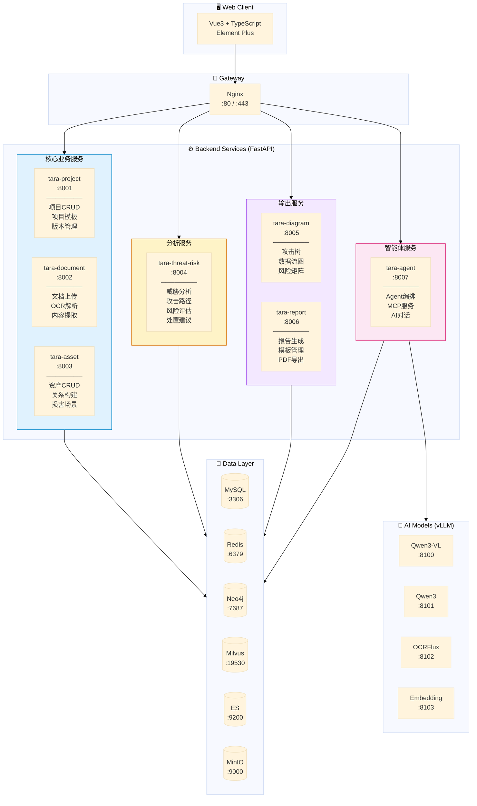

```mermaid
%%{init: {'theme': 'base'}}%%

flowchart TB
    subgraph Client["🖥️ Web Client"]
        Vue["Vue3 + TypeScript<br/>Element Plus"]
    end

    subgraph Gateway["🚪 Gateway"]
        Nginx["Nginx<br/>:80 / :443"]
    end

    subgraph Backend["⚙️ Backend Services (FastAPI)"]
        direction TB
        
        subgraph Core["核心业务服务"]
            Project["tara-project<br/>:8001<br/>────────<br/>项目CRUD<br/>项目模板<br/>版本管理"]
            Document["tara-document<br/>:8002<br/>────────<br/>文档上传<br/>OCR解析<br/>内容提取"]
            Asset["tara-asset<br/>:8003<br/>────────<br/>资产CRUD<br/>关系构建<br/>损害场景"]
        end
        
        subgraph Analysis["分析服务"]
            ThreatRisk["tara-threat-risk<br/>:8004<br/>────────<br/>威胁分析<br/>攻击路径<br/>风险评估<br/>处置建议"]
        end
        
        subgraph Output["输出服务"]
            Diagram["tara-diagram<br/>:8005<br/>────────<br/>攻击树<br/>数据流图<br/>风险矩阵"]
            Report["tara-report<br/>:8006<br/>────────<br/>报告生成<br/>模板管理<br/>PDF导出"]
        end
        
        subgraph AI["智能体服务"]
            Agent["tara-agent<br/>:8007<br/>────────<br/>Agent编排<br/>MCP服务<br/>AI对话"]
        end
    end

    subgraph Data["💾 Data Layer"]
        direction LR
        MySQL[(MySQL<br/>:3306)]
        Redis[(Redis<br/>:6379)]
        Neo4j[(Neo4j<br/>:7687)]
        Milvus[(Milvus<br/>:19530)]
        ES[(ES<br/>:9200)]
        MinIO[(MinIO<br/>:9000)]
    end

    subgraph Model["🧠 AI Models (vLLM)"]
        direction LR
        VL["Qwen3-VL<br/>:8100"]
        LLM["Qwen3<br/>:8101"]
        OCR["OCRFlux<br/>:8102"]
        Embed["Embedding<br/>:8103"]
    end

    Vue --> Nginx
    Nginx --> Core
    Nginx --> Analysis
    Nginx --> Output
    Nginx --> AI
    
    Core --> Data
    Analysis --> Data
    Output --> Data
    AI --> Data
    AI --> Model

    style Core fill:#E0F2FE,stroke:#0284C7
    style Analysis fill:#FEF3C7,stroke:#D97706
    style Output fill:#F3E8FF,stroke:#9333EA
    style AI fill:#FCE7F3,stroke:#DB2777

```
