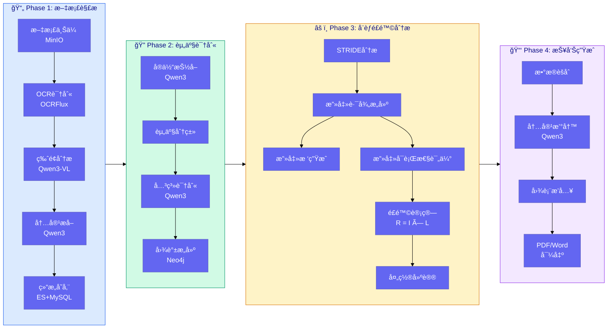

```mermaid
%%{init: {'theme': 'base', 'themeVariables': { 'primaryColor': '#6366F1', 'primaryTextColor': '#fff'}}}%%

flowchart LR
    subgraph Phase1["📄 Phase 1: 文档解æ"]
        direction TB
        Upload["文档上传<br/>MinIO"]
        OCR["OCR识别<br/>OCRFlux"]
        Layout["版é¢åˆ†æ<br/>Qwen3-VL"]
        Extract["内容æå–<br/>Qwen3"]
        Store1["结æ„存储<br/>ES+MySQL"]
        Upload --> OCR --> Layout --> Extract --> Store1
    end

    subgraph Phase2["🔠Phase 2: 资产识别"]
        direction TB
        Entity["å®ä½“抽å–<br/>Qwen3"]
        Classify["资产分类"]
        Relation["关系识别<br/>Qwen3"]
        Graph["图谱æ„建<br/>Neo4j"]
        Entity --> Classify --> Relation --> Graph
    end

    subgraph Phase3["âš ï¸ Phase 3: å¨èƒé£é™©åˆ†æ"]
        direction TB
        STRIDE["STRIDE分æ"]
        AttackPath["攻击路径æ„建"]
        AttackTree["攻击树生æˆ"]
        Feasibility["攻击å¯è¡Œæ€§è¯„ä¼°"]
        RiskCalc["é£é™©è®¡ç®—<br/>R = I × L"]
        Treatment["处置建议"]
        
        STRIDE --> AttackPath --> AttackTree
        AttackPath --> Feasibility --> RiskCalc --> Treatment
    end

    subgraph Phase4["📑 Phase 4: 报告生æˆ"]
        direction TB
        Aggregate["æ•°æ®èšåˆ"]
        Write["内容撰写<br/>Qwen3"]
        Chart["图表æ’å…¥"]
        Export["PDF/Word<br/>导出"]
        Aggregate --> Write --> Chart --> Export
    end

    Phase1 --> Phase2 --> Phase3 --> Phase4

    style Phase1 fill:#DBEAFE,stroke:#2563EB
    style Phase2 fill:#D1FAE5,stroke:#059669
    style Phase3 fill:#FEF3C7,stroke:#D97706
    style Phase4 fill:#F3E8FF,stroke:#9333EA


```
